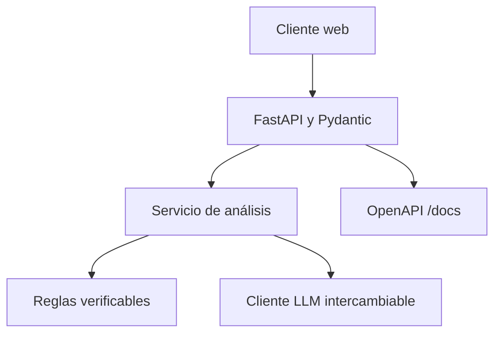

# CV_Analyzer

## 1. Información General

**Módulo:** Módulo 4 - Desarrollo de Aplicaciones con IA   
**Nombre del equipo: 13  
**Integrantes:**  

- Integrante 1: Jorge Balmore Sorto Rodriguez

## 2. Descripción del Problema

La ineficiencia, subjetividad y sobrecarga operativa en el proceso de filtrado inicial de currículums. La revisión manual de altos volúmenes de postulaciones genera cuellos de botella severos, fatiga en los evaluadores y una alta probabilidad de ignorar perfiles cualificados debido a una lectura rápida y superficial. Además, existe una dificultad inherente para cruzar y analizar objetivamente datos no estructurados contra los requerimientos técnicos y específicos de una vacante.

Los equipos de recursos humanos y reclutadores sufren de saturación de tareas mecánicas, invirtiendo la mayor parte de su tiempo en clasificar documentos en lugar de realizar evaluaciones cualitativas o entrevistas estratégicas.

Una arquitectura impulsada por Inteligencia Artificial, específicamente mediante modelos de Procesamiento de Lenguaje Natural (NLP), aporta un valor transformacional al automatizar la extracción de características y el análisis semántico de los textos. A diferencia de un sistema de filtrado tradicional (ATS) basado en coincidencia exacta de palabras clave, un enfoque con IA permite:

Comprensión contextual: Entender que herramientas o habilidades distintas pueden ser equivalentes o complementarias, analizando la experiencia real del usuario más allá de las palabras exactas que utilizó.

Cuantificación objetiva: Calcular métricas de similitud para generar un porcentaje de coincidencia fundamentado en los requerimientos del puesto.

Retroalimentación estructurada: Desglosar automáticamente la evaluación para exponer claramente las fortalezas detectadas y las brechas existentes, entregando datos procesables tanto al reclutador como al candidato.

Mitigación de sesgos: Estandarizar la evaluación inicial enfocándose estrictamente en competencias técnicas y experiencia demostrable, reduciendo la intervención de sesgos cognitivos o fatiga humana en la primera línea de selección.

---

## 3. Usuarios o Beneficiarios

Los usuarios a los que se apunta llegar es a los reclutadores, trabajadores de recursos hummanos y empresas en general que necesitan agilizar el proceso de seleccion de CV para una vacante disponble.

## 4. Descripción de la Solución
La aplicacion se encarga de analizar evidencia textual del CV de un postulante, la cual se ingresa en el espacio "Curriculum Vitae" y lo compara con los requisitos que la vacante esta solicitando, que se colocan en "Perfil del cargo".

Una vez lista esa parte se da click en "Analizar compativilidad" y en la parte inferior se despliega un cuadro que muestra los resultados del análisis. Que muestra un porcentaje segun la compatibilidad de las habilidades del postulante segun su CV y los requisitos del puesto identificando las habilidades que coinciden con los requisitos y las brechas o habilidades que le hacen falta al postulante para ser conciderado apto para el puesto.

## 5. Componente de Inteligencia Artificial

El proyecto utiliza una arquitectura de inteligencia artificial hibrida el proyecto está configurado para utilizar la tecnología de OpenAI, específicamente el modelo gpt-5-mini. Esta es una IA de procesamiento de lenguaje natural (NLP). Su trabajo es  "leer" el texto desestructurado del currículum y de la oferta de trabajo, comprender el contexto semántico, comparar ambos textos para encontrar coincidencias y redactar en lenguaje natural el resumen, las fortalezas, las brechas y las recomendaciones.

Una vez hecho eso en lugar de dejar que el LLM decida libremente la calificación final, el proyecto utiliza código Python estricto para determinar el porcentaje numerico real de coincidencia para la vacante.

Su formula es:
puntaje = esenciales (60) + experiencia (20) + formación (10) + complementarias (10). Cada subtotal es min(coincidencias/requisitos, 1) × peso. Si una categoría no contiene requisitos, aporta su peso completo para no penalizar información que el perfil no exige.

## 6. Estado Actual del Proyecto

Describan qué funciona actualmente y qué falta completar.

### Funcionalidades que ya funcionan

- Api
- El proyecto es ejecutable a travez de docker desktop

### Funcionalidades incompletas o pendientes

- uno de los dos workflows presenta problemas para ejecutarse.

### Evidencias actuales

Link Documento de evidencias: https://drive.google.com/file/d/1VQq2_7QCadmnc9k_g25Lw25EzZVmzMVz/view?usp=sharing

---

## 7. Arquitectura Actual

**Componentes actuales:**

**Diagrama:**

Se encuentra en docs/architecture.md

---

## 8. Arquitectura Objetivo

La arquitectura esperada es la misma planteada anteriormente .

**Elementos esperados:**

**Diagrama:**

Se encuentra en docs/architecture.md

---

## 9. Estructura del Repositorio

link de la estructura: https://drive.google.com/file/d/1SoDka_fniTdS-qxacjAImWcJfPZa9YBv/view?usp=sharing

**Notas sobre la estructura:**
.github/: contiene los archivos correspondientes a los workflows para github actions.

.venv/: contiene las librerias y las dependencias del proyecto.

app/: contiene el cuerpo principal del proyecto, en el se encuentran los modelos usados, la api, la carpeta "services" que contiene el codigo de como funciona el analizador y las reglas por las que esta regido.

docs/: se encuenntra la documentacion del proyecto, tambien al ejecutarlo ya sea localmente o mediante docker desktop en el se encuentra swagger.

tests/: almacena todos los scripts de prueba automatizada.

---

## 10. Instalación y Ejecución

Documenten cómo ejecutar el proyecto en un entorno local.

### Requisitos previos

- Python
- visual studio code
- Docker Desktop
- fastapi==0.116.1
- uvicorn[standard]==0.35.0
- pydantic-settings==2.10.1
- openai==1.102.0
- httpx==0.28.1
- pytest==8.4.1
- pytest-cov==6.2.1
- ruff==0.12.11

### Instalación
Al momento de descargar el repositorio de github para poder crear el contenedor para Docker Desktop se recomienda mover la carpeta del proyecto a la raiz del disco C: para poder utilizar el siguiente comando: 

- cd C:\cv-job-analyzer-v1.0.0; if (-not (Test-Path .env)) { Copy-Item .env.example .env }; docker compose up -d --build

Una vez utilizado el comando se creara nuestro contenedor en Docker Desktop y podremos acceder a el desde ahi.

Si se desea ejecutar localmente se utilizan los siguientes comandos uno por uno en una terminal nueva de visual studio:

python -m venv .venv
source .venv/bin/activate
pip install -r requirements.txt
cp .env.example .env
uvicorn app.main:app --reload

y se abre el navegador en Abrir http://localhost:8000

### Variables de entorno

- APP_VERSION: define la versión actual de tu aplicación.

- APP_ENV: indica el entorno en el que se está ejecutando la aplicación.

- LLM_PROVIDER: determina qué servicio o motor de Inteligencia Artificial se utilizará.

- OPENAI_API_KEY: es el espacio reservado para tu clave secreta de autenticación de OpenAI.

- OPENAI_MODEL: especifica el modelo exacto de inteligencia artificial al que se le enviarán las peticiones.

- LLM_TIMEOUT_SECONDS: establece el tiempo máximo de espera (en segundos) para recibir una respuesta de la IA.

- CORS_ORIGINS: configura las políticas de seguridad de intercambio de recursos (CORS). Define qué direcciones web tienen permiso para hacer peticiones a tu servidor backend.

---

## 11. Datos Utilizados

Para fines practicos los datos utilizados en este proyecto son simulados, no son datos de CV reales de alguna persona.

Los datos utilizados no son considerados como informacion sensibles puesto que solamente se toma en cuenta las habilidades/experiencias del postulamte y no se utiliza algun otro tipo de informacion personal. Y por ultimo para el correcto funcionamiento de la aplicacion se necesita que los datos ingresados sean igual o mayores a 100 caracteres minimo.

---

## 12. Riesgos Técnicos y Deuda Técnica

- Privacidad y Fuga de Datos: Los currículums contienen información personal sensible (teléfonos, direcciones, correos). Enviar esta información directamente a la API de OpenAI supone un riesgo de privacidad y cumplimiento normativo.

- Inconsistencia del LLM (Alucinaciones): Se utiliza un sistema híbrido. Por lo que si las reglas deterministas dicen que el candidato cumple con el 80% de los requisitos, pero el LLM "alucina" y genera un texto diciendo que el candidato no es apto, la experiencia del usuario se rompe.

- Dependencia y Latencia de Terceros: Se tiene un LLM_TIMEOUT_SECONDS=30. Si OpenAI experimenta latencia o se cae, la aplicación fallará o dejará a los usuarios esperando indefinidamente.

---

## 14. Limitaciones Actuales

Describan con honestidad las limitaciones del prototipo.

- No analiza directamente el contenido de un documento, se necesita introducir las experiencias que posee en el recuadro.
- uno de los workflows no se ejecuta correctamente. 

---

## 15. Evidencias
Link Documento de evidencias: https://drive.google.com/file/d/1VQq2_7QCadmnc9k_g25Lw25EzZVmzMVz/view?usp=sharing

Se encuentra en docs/architecture.md

---

## 16. Créditos y Referencias

Incluyan librerías, modelos, datasets, documentación o servicios utilizados.

- Librerias:
fastapi==0.116.1
uvicorn[standard]==0.35.0
pydantic-settings==2.10.1
openai==1.102.0
httpx==0.28.1
pytest==8.4.1
pytest-cov==6.2.1
ruff==0.12.11

- Servicios:
OpenAI (gpt-5-mini)
GitHub

