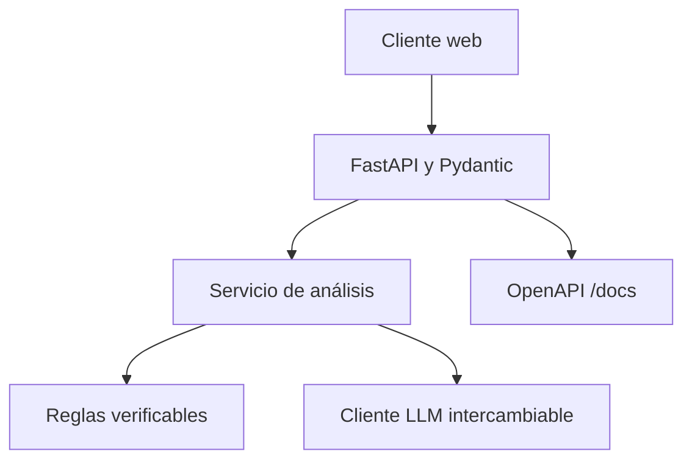

# Arquitectura

```mermaid
flowchart TD
    UI[Cliente web] --> API[FastAPI y Pydantic]
    API --> S[Servicio de análisis]
    S --> R[Reglas verificables]
    S --> L[Cliente LLM intercambiable]
    API --> O[OpenAPI /docs]
```

El LLM extrae contexto y advertencias, pero no asigna el puntaje. La regla pondera competencias esenciales 60%, experiencia 20%, formación 10% y habilidades complementarias 10%.

